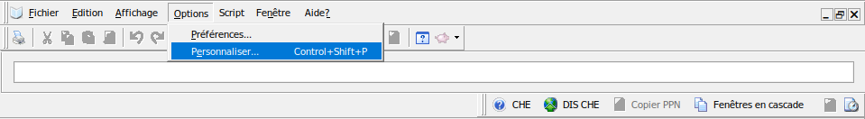
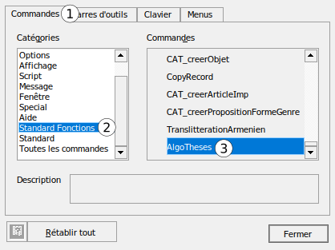

<div align="center">

# WinIBW AlgoSudoc


[](https://github.com/eonm-abes/winibw-algo-sudoc/releases/latest/download/Algo_sudoc.js)


</div>

Ce script permet de récuperer grâce à [AlgoSudoc](http://documentation.abes.fr/sudoc/manuels/controle_bibliographique/rapports_chargement_theses_fr/index.html) les rapports de chargement de données de [Theses.fr](http://www.theses.fr/) depuis WinIBW.

## Installation

> __⚠️ Avant toute modification pensez à conserver une copie fonctionnelle du fichier `C:\oclcpica\WinIBW30\defaults\pref\setup.js`__

1- [Téléchargez la dernière version d'AlgoSudoc](https://github.com/eonm-abes/winibw-algo-sudoc/releases/latest/download/Algo_sudoc.js)


2- Le fichier `Algo_sudoc.js` doit être copié dans le dossier : `C:\oclcpica\WinIBW30\chrome\ibw\scripts\`

3- La ligne suivante doit être rajoutée au fichier `C:\oclcpica\WinIBW30\defaults\pref\setup.js` (à la suite des lignes contenant `ibw.standardScripts.script.XX`) :

```js
pref("ibw.standardScripts.script.AlgoSudoc", "resource:/scripts/Algo_sudoc.js");
```

Le script est à présent installé, WinIBW doit être redémarré pour que l'installation devienne effective.

### Ajouter le script à l'interface de WinIBW

<div align="center">



</div>

Depuis la barre de menu : `Options` ↪ `Personnaliser` (Ctrl+Shift+P)

<div align="center">



</div>

Dans l'onglet `Commandes`➀ :

- Sélectionnez dans le panneau `Catégorie`  l'entrée `Standard Fonctions`➁
- Sélectionnez dans le panneau `Commandes` le script `AlgoSudoc`➂
- Glissez déposez le script sélectioné sur l'une des barres de menu de WinIBW

## Utilisation

Le script peut être utilisé depuis une notice ou une liste de notices. Lorsque le script est utilisé sur une liste de résultats seule la notice sélectionnée est analysée par AlgoSudoc.

## Développement

Vous devez disposer d'un environement de développement [Node.js](https://nodejs.org/en/download/).

```
npm install
npm run build
```

Le script devant être installé se trouve dans le dossier `dist/`.

Le contenu du dossier `dist/` est généré automatiquement, il ne doit pas être édité à la main.

---

## Références

[Documentation d'AlgoSudoc](http://documentation.abes.fr/sudoc/manuels/controle_bibliographique/rapports_chargement_theses_fr/index.html)<br>[Documentation des scripts WinIBW](http://documentation.abes.fr/sudoc/manuels/logiciel_winibw/scripts/index.html)

<small>Développement :</small>

[Scripting in WinIBW: Getting started](https://www.zeitschriftendatenbank.de/fileadmin/user_upload/ZDB/pdf/winibw/Scripting_in_WinIBW3_V_1_17.pdf)
